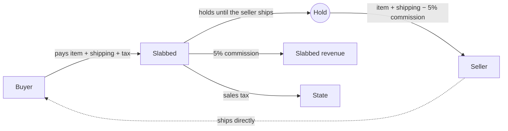
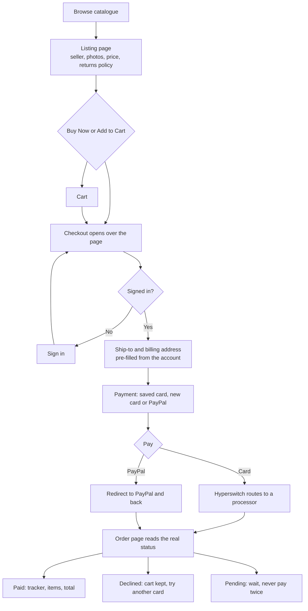
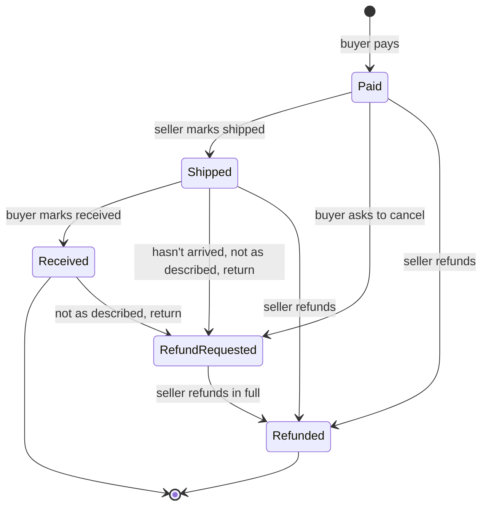
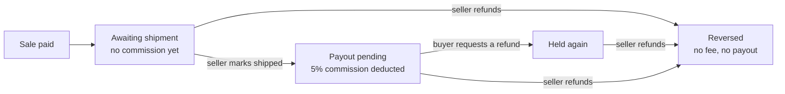
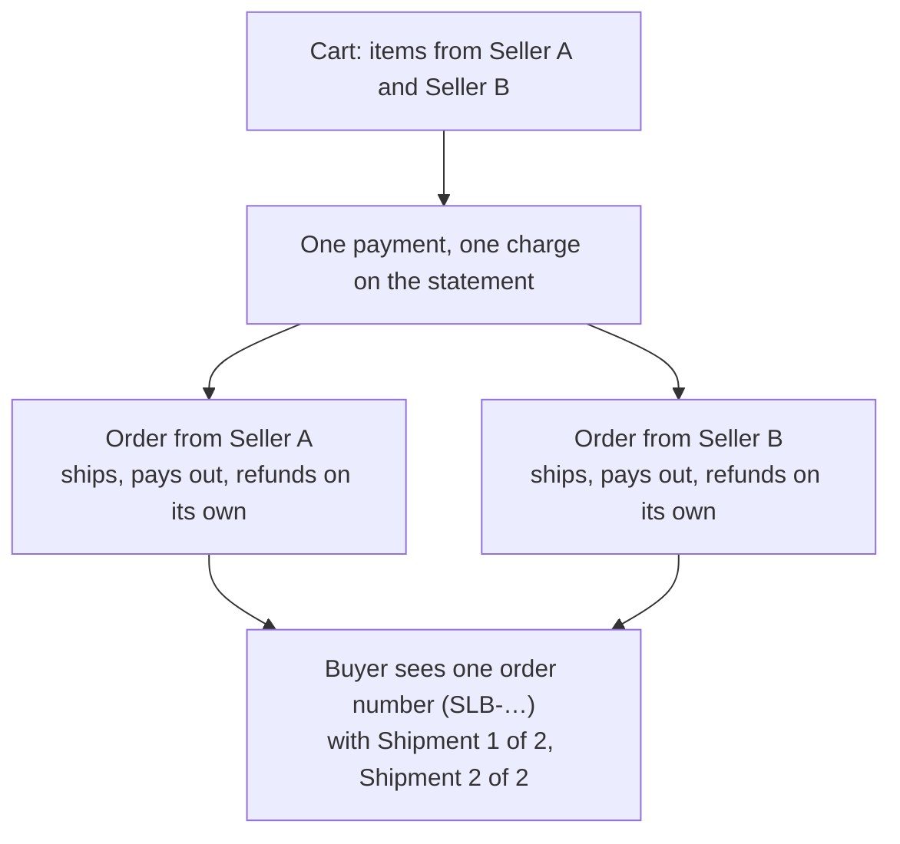
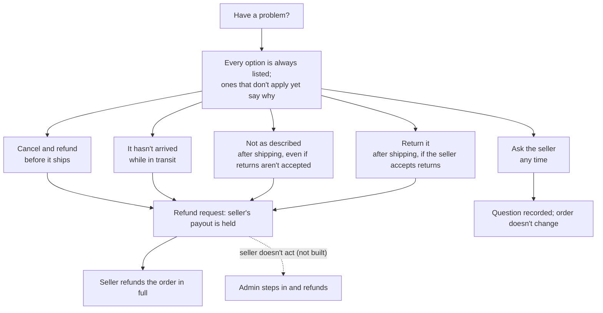
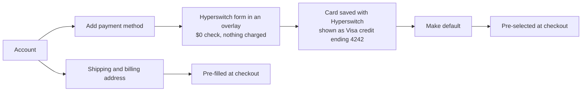
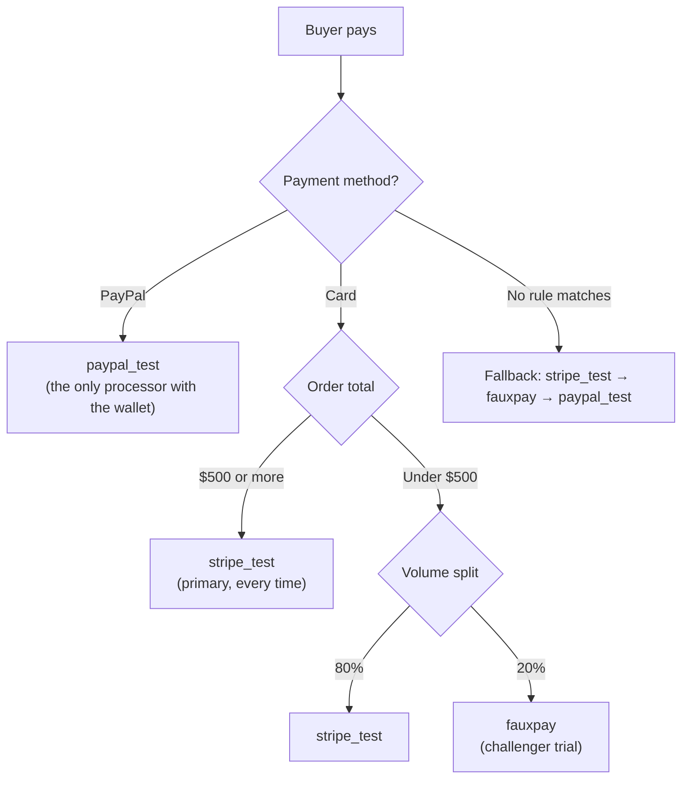

# Slabbed — a collectibles marketplace on Hyperswitch

A peer-to-peer marketplace for US coins and trading cards. It takes a buyer
from browsing to a **real, completed payment in the Hyperswitch sandbox**, then
on through shipping, problems, returns and refunds.

**Live demo:** <https://juspay-prototype.vercel.app>. [Try it](#try-it), right below,
says how to sign in and what to click.

## Contents

1. [Try it](#try-it)
2. [The marketplace](#the-marketplace)
3. [What payments have to get right](#what-payments-have-to-get-right)
4. [How it's built](#how-its-built)
5. [Product flows](#product-flows)
6. [Hyperswitch: what we enabled and how routing works](#hyperswitch-what-we-enabled-and-how-routing-works)
7. [What happens in Hyperswitch when you act](#what-happens-in-hyperswitch-when-you-act)
8. [Payment outcomes](#payment-outcomes)
9. [Payment choices and why](#payment-choices-and-why)
10. [Edge cases we handle](#edge-cases-we-handle)
11. [Out of scope, with the approach](#out-of-scope-with-the-approach)

---

## Try it

Everything runs on the live site: **<https://juspay-prototype.vercel.app>**.
Nothing to install, and every payment is a real payment in the Hyperswitch
sandbox, so no real money moves.

### 1. Sign in

Sign-in is a demo: no real account is created, and nothing is sent to Google,
Apple or anyone else.

1. Click **Sign in** in the top right (or just press **Buy Now** on any listing;
   you'll be asked to sign in and brought straight back).
2. Pick any option:
   - **Continue with Google** or **Continue with Apple** → choose **Alex Rivera**
     or **Mike Chen** → **Continue**.
   - **Continue with email** → type `alex@example.com` or `mike@example.com`.
3. To switch accounts later, open the account menu (your initials, top right) →
   **Account** → **Demo account**, or sign out and sign in again.

| Account | Use it for |
| --- | --- |
| **Alex Rivera** (`alex@example.com`) | Buyer flow: buying, orders, problems and refunds, saved cards |
| **Mike Chen** (`mike@example.com`) | Seller flow: every listing is Mike's, so he ships, sees payouts and refunds |

### 2. Buy something (as Alex)

1. Open any listing and press **Buy Now**. Checkout opens over the page.
2. The address is pre-filled. Press **Continue to Payment**.
3. Pay with a test card from the table below, or with **PayPal**.
4. You land on the order page, which shows the real payment status.

### 3. Follow the order through

1. **As Mike:** **Sell** → find the sale → **Mark shipped**. His payout moves to
   *Payout pending*.
2. **As Alex:** **Orders** → open the order → **Mark received**, or
   **Have a problem?** to cancel, report it not arriving or not as described,
   return it, or ask the seller.
3. **As Mike:** open the order → **Refund buyer**. The refund is a real
   Hyperswitch refund, and Alex's tracker ends at *Refunded*.

### Test cards

Any future expiry date and any CVC.

| To see | Use |
| --- | --- |
| A successful payment | `4242 4242 4242 4242` |
| A declined payment | `4000 0000 0000 0002` |
| A lost or stolen card | `4000 0000 0000 9987` |
| Insufficient funds (only when routed to fauxpay, which is random under $500) | `4000 0000 0000 9995` |
| Routing to the primary processor | Any card order of $500 or more |
| PayPal | The PayPal button → approve on the simulated PayPal page |

**Start over:** **Account** → **Reset demo** clears the cart, created listings
and sign-in in your browser. Payments already made stay in the sandbox.

---

## The marketplace

Individuals list, individuals buy, buy-it-now only. Any account can buy and
sell, which is how collectors behave. Prices run from a $20 raw card to a
$6,000 graded coin in the same catalogue, and every item is a one-of-one: once
sold, it's gone.

## What payments have to get right

1. **We hold a stranger's money until another stranger ships.** When to
   capture, when to release and how to refund are one question: who carries
   the risk in that gap.
2. **The payment method decides who carries the risk.** PayPal protects buyers
   against "not authentic" and "misrepresented condition", but its seller
   protection excludes not-as-described, and as merchant of record the dispute
   names us. Cards follow network rules we can predict.
3. **Retry safety beats conversion.** Retrying an ambiguous payment can charge
   one collector twice for another collector's coin, and a double charge
   between two individuals can't be fixed with an apology.
4. **More than one provider is structural.** Buyers expect cards and PayPal,
   sellers want payouts to a bank or PayPal, and high-value buyers will want
   financing. No single provider does all of it, which is why we use an
   orchestrator.

---

## How it's built

| Layer | Choice |
| --- | --- |
| Product | Responsive web app |
| Front end | React + TypeScript, built with Vite, styled with Tailwind |
| Back end | Serverless functions on Vercel. **No database**: Hyperswitch is the record of truth for payments, and order state lives on the payment itself |
| Hosting | Vercel, deployed from `main` |
| Payments | **Hyperswitch** for payment orchestration: checkout SDK, routing across three processors, refunds, saved cards |
| Product strategy | Claude, acting as product lead: framing the vertical, scoping flows, weighing trade-offs |
| Development and design | AI-assisted with Claude Code, with design and engineering run as separate agents and reviewed against the product framing |

Three rules shape the build:

- **The secret key never reaches the browser.** Payments are created on the
  server; the browser only gets a one-time client secret.
- **The server sets the price.** The browser sends what's in the cart, never an
  amount.
- **Card details stay inside Hyperswitch's checkout form**, out of our code and
  PCI scope.

---

## Product flows

### Buyer: browse to paid

### Order lifecycle: who does what

Each order page shows this as a progress tracker (Paid → Shipped → Received,
or ending in *Cancellation requested*, *Return requested* or *Refunded*).

### Seller: money over time

No payout is actually sent (the sandbox has no payout rail), so shipped money
shows as **Payout pending**.

### A cart from several sellers

Paying once matches eBay and Etsy, and a cart can never end half paid. Splitting
into one order per seller means one seller's refund never touches the other's
sale.

### Have a problem?

- **Not every problem is a refund.** A buyer whose coin hasn't shipped usually
  wants an answer, so "Ask the seller" doesn't hold the seller's money.
- **Returns are the seller's call, per listing.** A raw coin "sold as found"
  and a certified slab are different risks, so every listing says *Returns
  accepted* or *Ineligible for return*, on the listing, in checkout and on the
  order.
- **"Not as described" can't be switched off.** That's the US buyer-protection
  norm across eBay, PayPal and card networks.
- **The policy is fixed at purchase**, so a seller changing it later doesn't
  change an order already paid for. The server enforces the same rules as the
  menu.

### Account: saved cards and addresses

---

## Hyperswitch: what we enabled and how routing works

### Processors enabled

| Processor | Stands in for | Methods | Used for |
| --- | --- | --- | --- |
| **stripe_test** | Stripe, the primary card processor | Credit and debit cards | Card payments of $500+, 80% of card payments under $500, saving cards |
| **fauxpay** | A challenger card processor | Credit and debit cards | 20% of card payments under $500 |
| **paypal_test** | PayPal | Cards, plus the **PayPal wallet** (enabled here only) | Every PayPal payment |

These are Hyperswitch's simulated processors. Switching to real Stripe and
PayPal is a dashboard change, not a code change.

### Routing

**The buyer chooses the payment method; Hyperswitch chooses the processor.**
The buyer only ever sees "Card" or "PayPal".

- **High-value slabs always go to the primary processor.** With retries off
  there's no second attempt, so a one-of-one coin isn't used for experiments.
- **Small card payments trial a challenger.** A marketplace adds a second
  processor for lower fees, leverage and outage cover, but can't judge one
  without real traffic. Orders under $500 produce that data quickly where a
  failure costs a $40 sale. It's the first step toward approval-rate-based
  routing.
- **Verified on the live sandbox:** $900 and $500 cards went to stripe_test;
  20 × $40 cards split 12 stripe_test / 8 fauxpay; PayPal at $40 and $900 went
  to paypal_test.

### Settings

| Setting | Value | Why |
| --- | --- | --- |
| Auto Retries | **Off** (default was on) | Re-sending a timed-out $6,000 payment to another processor can charge twice |
| Capture | Immediately | The "hold" is a ledger, not a card authorisation, which would expire in about 7 days |
| Saved cards | On-session, buyer ticks "Save card" | Repeat collectors check out faster; no charges without the buyer present |
| 3DS | Dashboard default, no challenge flow built | See *Out of scope* |

---

## What happens in Hyperswitch when you act

| You do this | Hyperswitch does this |
| --- | --- |
| **Continue to payment** in checkout | A payment is created for the server-calculated total, with the buyer, both addresses and each seller's share attached |
| **Edit the address** and continue again | The same payment is updated; no second payment, same amount |
| **Pay by card** | The routing rule picks stripe_test or fauxpay, and the card is charged |
| **Pay with PayPal** | Routed to paypal_test; the buyer is redirected to PayPal and back |
| **Open the order page** | The payment and its refunds are read, so the page shows the real status, never what the redirect implied |
| **Check again** (unclear outcome) | The payment is read again; it can never charge |
| **Mark shipped / Mark received** | The order's status and date are saved on the payment, then read back to confirm |
| **Report a problem** | The request, its type and the buyer's words are saved on the payment |
| **Ask the seller** | The question is saved on the payment; nothing else changes |
| **Refund buyer** (seller) | A refund is issued for that seller's order total, protected against double clicks |
| **Add payment method** | A $0 payment saves the card to the buyer's Hyperswitch customer record |
| **Make default / Remove** a card | The customer's default card is set, or the card is deleted |

---

## Payment outcomes

| Outcome | What the buyer sees | Their cart | Try it with |
| --- | --- | --- | --- |
| **Successful** | Order page, tracker at *Paid*, items marked sold | Cleared of those items | `4242 4242 4242 4242` |
| **Declined** | "Your bank declined this payment." and *Try a different card* | Kept | `4000 0000 0000 0002` |
| **Lost or stolen card** | "Your bank declined this card." | Kept | `4000 0000 0000 9987` |
| **Insufficient funds** (soft decline) | The reason, plus "Your cart and address are saved, so you can try again." | Kept | `4000 0000 0000 9995` (fails only when routed to fauxpay) |
| **Our side failed** | "Nothing has been charged…" and *Try again* | Kept | — |
| **PayPal completed** | Same as successful, after returning from PayPal | Cleared | PayPal button, approve |
| **PayPal not finished** | "You didn't finish paying on PayPal. Nothing has been charged." | Kept | PayPal button, come back without approving |
| **Bank check required** (3DS) | "Your bank needs to confirm it's you." | Kept | — |
| **Processing** | "Payment sent — waiting on your bank. You don't need to do anything." | Kept until paid | — |
| **Unclear** (no answer after 30 s) | "We're not sure whether that went through. Don't pay again yet." and **Check again** | Kept | — |
| **Cancelled** | "This payment was cancelled. Nothing has been charged." | Kept | — |
| **Under review** | "This payment is being reviewed. Don't pay again." | Kept | — |
| **Refunded** | Tracker ends at *Refunded*: "Your bank may take a few days to show it." | — | Seller refunds the order |

Every one of Hyperswitch's payment statuses maps to one of these; "processing"
and "needs the buyer" are never shown as failures.

---

## Payment choices and why

| Choice | Why, for this marketplace |
| --- | --- |
| **Hyperswitch's checkout form**, not our own card fields | Card data never touches our code, and payment methods become a dashboard setting. PayPal needed only a return address, which is the practical case for an orchestrator |
| **Cards and PayPal** | Collectors come from eBay and expect PayPal at every price |
| **Capture now, release on shipping** | Individual sellers ship when they reach the post office; an authorisation would expire first |
| **Seller pays a 5% commission, at release** | Nothing is added to a buyer's total after they've decided on a $1,800 item, and a sale refunded before shipping pays no fee |
| **Never retry an unclear payment** | "Check again", not "Pay again". A double charge is worse than a lost sale |
| **One payment per cart, one order per seller** | Pay once; each seller ships and refunds independently |
| **The seller refunds** | They know the item and answer the buyer |
| **Returns set per listing; "not as described" always open** | As-found raw items and certified slabs carry different risks |
| **Show credit or debit** | A buyer's dispute rights differ between them, which matters on a four-figure coin |
| **Checkout over the page** | The buyer keeps the item in view while paying, and can't close it mid-payment |
| **No database** | Hyperswitch holds the truth, so there's nothing to reconcile. The trade-off: order lists are slower to load (1–2 s, up to 6 s cold) |
| **3DS left out** | US-only, so it isn't mandated. It would shift liability on stolen-card chargebacks, but does nothing for "not as described" disputes |

---

## Edge cases we handle

**While paying**
- **Double clicks, refreshes or a second tab** reuse the same payment, never a
  second charge.
- **Cart changed** after a payment started → a fresh payment for the new total.
- **Closing checkout mid-payment** is blocked until the payment settles.
- **Returning from PayPal** doesn't count as paid until the server confirms it.
- **Declines keep the cart and address** so the buyer can try another card.
- **Sold items** can't be bought again, and **your own listings** stay out of
  the charge.
- **Signing in at checkout** brings the buyer straight back into it.

**After paying**
- **Saving an order update**: Hyperswitch sometimes reports an error even when
  the save worked, so every update is read back before the page says it saved.
- **Out-of-order actions** (receiving before shipping, a refund request after a
  refund) are refused.
- **The wrong person acting** (a buyer shipping, another seller refunding) is
  refused.
- **Refund double clicks** are deduplicated; a refund already in progress
  blocks another.
- **A return on an ineligible item, or cancelling a shipped one**, is refused
  on the server, not just hidden in the menu.
- **Buyers never see commission; sellers never see tax or the buyer's card.**
- **A listing opened from an order** links back to that order.

---

## Out of scope, with the approach

| Not built | Approach |
| --- | --- |
| **Affirm (pay later)** | Fits collectors buying a $6,000 slab. Enable it on a processor in Hyperswitch, show it above about $500 |
| **ACH bank debit** | Much cheaper on large orders, but reversible for 60 days. Offer only to repeat buyers, and hold the payout until it clears |
| **Limiting PayPal on gold coins** | Not covered by PayPal buyer protection but still charged back to us. Restrict payment methods per order when the payment is created |
| **Real sales tax** | Today tax is a flat 8% on items, rounded per seller. US marketplace facilitator laws make the marketplace, not the seller, responsible for collecting and remitting sales tax in almost every state that has one. The rate depends on where the item ships, shipping is taxable in some states and not others, and many states exempt bullion and some coins. *Approach:* at Continue to payment, send the ship-to address and each seller's items (with a product tax code per category: coin, bullion, card) to a tax service such as Stripe Tax or Avalara; use its figure in the server-calculated total; recalculate when the address changes; refund the tax with the order; file and remit per state from the tax service's reports |
| **Real seller payouts** | One charge per cart, then one transfer per seller when they ship (Stripe Connect). Verify sellers (KYC) before their first payout |
| **Admin as the backup when a seller doesn't act** | Sellers refund their own orders today. If a seller ignores a refund request, never ships, or the buyer and seller can't agree, an admin steps in: a queue of refund requests past a response deadline, the ability to refund the order in full on the seller's behalf, and the seller's payout reversed. An early admin view (all transactions, a disputes filter) exists in the code but is hidden until this is designed |
| **Webhooks and bank disputes** | Receive disputes and refund updates, freeze that seller's payout, and close any in-app request so the buyer isn't refunded twice |
| **Refund a return only once the item is back** | Today a return request can be refunded straight away. Hold the refund until the seller confirms the item arrived back, and only accept return requests within a 14–30 day window after delivery |
| **3DS challenges** | Request 3DS above a value threshold, where liability shift pays for the friction |
| **Smarter routing** | Approval-rate-based routing once each processor has about 25 real payments |
| **Apple Pay and Google Pay** | Faster checkout; Apple Pay needs a stable verified domain |
| **Smaller gaps** | Refunding part of one seller's order; releasing the payout on carrier-confirmed delivery rather than on "marked shipped"; automatically refunding a second buyer if two pay for the same item at once |
