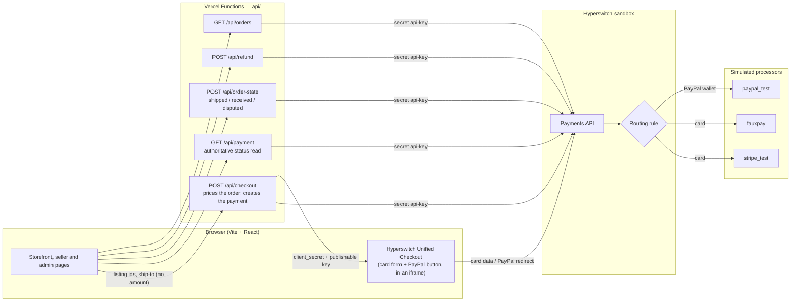
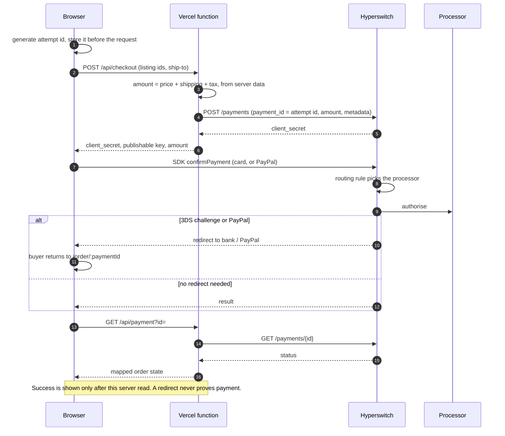
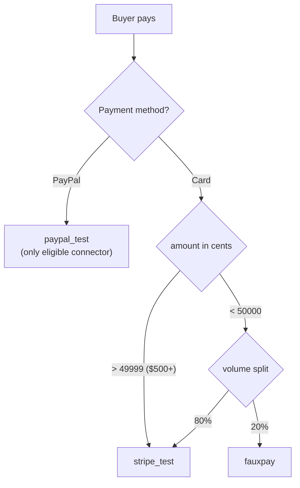
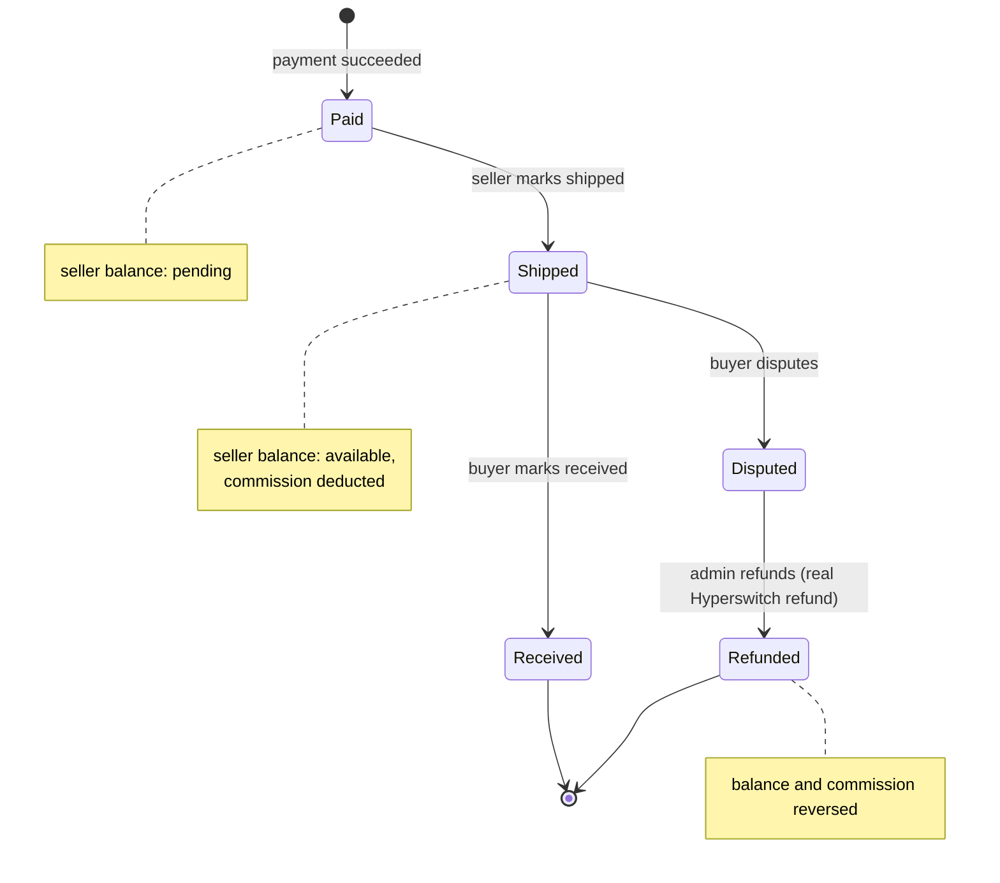

# Slabbed — a collectibles marketplace on Hyperswitch

A peer-to-peer marketplace for US coins and trading cards that takes a buyer
from browsing to a **real, completed payment in the Hyperswitch sandbox**, and
then on through shipping, disputes and refunds.

> **Status:** payment path and marketplace screens built; sandbox configured
> and verified on 2026-09-16. [PLAN.md](PLAN.md) holds the full reasoning, and
> this file is the summary. Everything under "Not built" is written up with an
> approach instead.

---

## The marketplace

Individuals list, individuals buy, buy-it-now only. Any account can be buyer
and seller, which is how collectors behave. Prices run from a $20 raw card to a
$6,000 graded coin in the same catalogue, and that spread shapes most of the
payment decisions below.

```
Buyer ──pays──> Slabbed ──holds──> (seller ships directly) ──releases──> Seller
                   │                                                       │
                   ├── commission ──> Slabbed          payout ────────────┘
                   └── sales tax ───> State            to PayPal / bank
```

## What payments have to get right here

1. **We hold a stranger's money until another stranger ships.** Capture
   timing, refunds and release are one question about who carries risk in
   that gap.
2. **The payment method decides who carries the risk.** PayPal's buyer
   protection covers "not authentic" and "misrepresented condition", but its
   *seller* protection excludes not-as-described, and as merchant of record the
   dispute names us. Cards follow network rules we can predict.
3. **Retry safety beats conversion.** Retrying an ambiguous payment can charge
   one collector twice for another collector's coin. A double charge between
   two individuals can't be fixed by apologising.
4. **More than one provider is structural.** Buyers expect cards and PayPal;
   sellers want payouts to a bank or PayPal; high-value buyers will want
   financing. No single provider does all of it, which is why we use an
   orchestrator.

---

## Architecture

No database and no custom backend server. The browser talks to a handful of
Vercel functions, and those are the only code holding the secret key.
Hyperswitch is the record of truth for payments, and even fulfilment state
(shipped, received, disputed) lives in the payment's own metadata.



**Security boundaries**
- The secret key (`JUSPAY_API_TEST_KEY`) is read only inside `api/` and never
  has a `VITE_` prefix, since Vite would inline it into the bundle.
- **The server sets the amount** from its own catalogue. The checkout request
  type has no `amount` field at all.
- Card numbers only ever enter Hyperswitch's iframe, so they stay out of our
  code and our PCI scope.

---

## A payment, end to end



**Idempotency.** Hyperswitch has no idempotency header on `POST /payments`,
so the browser's attempt id doubles as the `payment_id`. A duplicate submit,
refresh or second tab re-sends the same id. Hyperswitch rejects it with
`HE_01`, and the server reads the existing payment instead of creating a
second one.

**Every Hyperswitch status is mapped**, all 17 of them, not only the four in
the quickstart. `requires_customer_action` and `processing` are their own
states, never failures, and an unrecognised status maps to `unknown`, which
shows "Don't pay again yet" and a **Check again** button that only re-reads.

---

## Payment methods and routing

**The buyer chooses a payment method. Hyperswitch chooses the processor.** The
buyer only ever sees "Card" or "PayPal", and processors stay out of sight.

| Buyer chooses | Goes to | Why, for this marketplace |
| --- | --- | --- |
| **PayPal** | `paypal_test` | The buyer's choice, not a routing decision: it's the only connector with the PayPal wallet. Offered at every price, because collectors come from eBay and expect it |
| **Card, $500 or more** | `stripe_test` | The primary processor, every time. With retries refused there is no second attempt, so high-value slabs aren't used for experiments |
| **Card, under $500** | 80% `stripe_test` / 20% `fauxpay` | A challenger processor trialled against the incumbent, on orders where a failure costs a $40 sale rather than a one-of-one coin |
| No rule matches | `stripe_test` → `fauxpay` → `paypal_test` | Default fallback. `paypal_test` is last so a card payment never shows up as "PayPal" |



**Why split small card payments at all.** A marketplace adds a second
processor for lower fees, negotiating leverage and outage cover, but it can't
judge one without sending it real traffic. The approval rate on *our* buyers
is the number that matters. The split gathers that data, and it's the first
step towards Auth Rate Based routing, which needs about 25 finished payments
per processor before it can score anything. Our prices decide where to run
the trial: most orders are small and most money sits in the few large ones,
so orders under $500 produce data quickly at little risk. We chose 80/20 over
50/50 because the point is to measure a challenger against the incumbent,
starting small.

**This is routing before an attempt, not retrying after one.** Auto Retries
was on by default (max 3). We switched it off, because re-sending a timed-out
$6,000 payment to a second processor can charge the buyer twice. Hyperswitch
reconciles the two attempts afterwards but can't un-charge the card.

**Verified against the live sandbox (2026-09-16):**

| Test | Result |
| --- | --- |
| $900 card, $500.00 card | `stripe_test` |
| 20 × $40 card | 12 `stripe_test`, 8 `fauxpay` |
| PayPal at $40 and at $900 | `paypal_test`, `requires_customer_action` with a redirect |
| `is_auto_retries_enabled` | `false` |

**What the sandbox can't show.** The processors are simulated and approve and
decline identically, so the build shows the routing *mechanism* but not one
processor genuinely out-approving another. Decline messages come from a
simulator, not a card issuer.

---

## Order and money lifecycle

Money moves when someone acts, not on a timer, so every transition is
something a reviewer can click.



The buyer is charged **item + shipping + sales tax** (flat rate) as one
payment. The seller is credited **item + shipping − commission** later. The
buyer never sees the commission and the seller never sees the tax.

---

## Decisions

| Decision | Why |
| --- | --- |
| **Unified Checkout SDK** | Card data never touches our code, and payment methods are a dashboard setting. PayPal was added and Affirm removed without a code change, which is the practical argument for an orchestrator |
| **Simulated processors, not real Stripe** | Real Stripe needs a support ticket for raw card data access, with unknown lead time. The simulators cover everything the core flow needs: distinct declines, a 3DS challenge, a PayPal redirect, and three connectors to route between |
| **Capture immediately; the hold is a ledger, not an authorisation** | Card authorisations expire in about 7 days, and an individual seller ships when they reach the post office. The reversal tool is a refund, not a void |
| **Seller pays the commission, at release** | Nothing is added to a buyer's total after they've decided on a $1,800 item. A sale refunded before release never pays a fee |
| **Never auto-retry an ambiguous payment** | "Check again", not "Pay again". A double charge is worse than a lost sale |
| **One payment per seller in a multi-seller cart** | A single split payment can't represent one seller's half failing, and that is the normal failure |
| **No database; Hyperswitch is the read model** | No reconciliation story to explain. The limit: metadata isn't filterable in the v1 API, so seller views page through payments and filter in memory, which is fine at demo volume |
| **3DS left at its default** | We're US-only, so it isn't a mandate. It buys liability shift on stolen-card chargebacks, which matters on a $6,000 coin. It does nothing for "not as described" disputes, and we don't pretend it does |

### Hyperswitch features, and what we did with each

| Feature | Verdict |
| --- | --- |
| Unified Checkout, Payments, Refunds, Metadata update | **Built on** |
| Rule-based routing (amount + volume split) | **Configured**, verified |
| PayPal wallet | **Configured**, no code change |
| 3DS | **Default**, exercised with the 3DS test card |
| Auto Retries / Smart Retries | **Turned off**, for the double-charge reason above |
| Auth Rate Based and elimination routing | **Deferred**: needs payment history and real processors |
| Least Cost (US debit) routing | **Deferred**: sandbox supports it through Adyen only |
| Webhooks | **Deferred**: nothing durable to write to and no stable URL, and every flow we build has the buyer present |
| Extended authorisation, overcapture, network tokenisation | **Off**: we capture straight away at a fixed amount and don't save cards |
| Surcharge | **Refused**: banned on debit, restricted in several states, and we earn through commission |

---

## Not built, with the approach

- **Affirm (pay later).** It fits the top of this market: a collector who
  wants a $6,000 slab now and pays over months. Affirm pays us up front and
  takes the credit risk, so our hold doesn't change. It's deferred because it
  adds a second redirect method with its own pending and declined-application
  states. *Approach:* enable Pay Later → Affirm on a connector (the sandbox's
  `stripe_test` already offers it), show it only above about $500, and confirm
  on the server exactly as for PayPal.
- **ACH bank debit.** It costs about $5 against about $174 in card fees on a
  $6,000 slab, but a consumer can return a debit as unauthorised for 60 days.
  *Approach:* only for buyers with a completed purchase, payout held until the
  debit clears, and the payment shown as `processing` meanwhile. Needs real
  Stripe.
- **Limiting PayPal where it hurts us.** Gold coins aren't covered by PayPal's
  buyer protection but can still be charged back to us. *Approach:* the server
  passes `allowed_payment_method_types` when it creates the payment (verified
  in the sandbox), so gold coins or large orders show cards only.
- **Real Stripe and real PayPal** behind the same routing rule. This changes
  dashboard configuration only, not code.
- **Auth Rate Based routing,** once about 25 real payments per processor
  exist. It's the next step after the 80/20 trial.
- **Apple and Google Pay.** They add speed, not protection, and Apple Pay
  needs a stable verified domain, which preview deployments don't have.
- **Seller payouts.** Stripe Connect separate charges and transfers, called
  when the seller ships. Hyperswitch's split payments only support
  direct/destination charges, which pay the seller too early.
- **Webhooks, concurrency (two buyers racing for one item), carrier-confirmed
  release, authenticity checks, seller KYC, saved cards.**

**Known gaps in what is built**
- `update_metadata` returns a connector error on every simulated processor even
  though the write lands, so every write is read back before the UI reports
  success.

---

## Running it

Requires Node 22+ and a Hyperswitch sandbox account.

```bash
npm install
cp .env.example .env   # fill in the sandbox keys
npm run dev            # Vite serves the front end and api/ functions together
```

| Command | What it does |
| --- | --- |
| `npm run dev` | App and API functions locally (Vite middleware runs `api/`) |
| `npm run build` | Typecheck and production build |
| `npm run test:unit` | Money, cart, attempt-id and state-mapping tests |
| `npm run test:sandbox` | Tests against the live Hyperswitch sandbox |
| `npm run e2e` | Playwright, real browser, real sandbox |
| `npm run lint` / `npm run format` | oxlint / Prettier |

### Sandbox setup

1. **Connectors:** `stripe_test`, `fauxpay` and `paypal_test`, all with credit
   and debit cards. Enable Wallet → PayPal on `paypal_test` only.
2. **Default fallback order:** `stripe_test`, `fauxpay`, `paypal_test`.
3. **Workflow → Routing → Rule Based**, then activate it:
   - card AND amount < `50000` → volume split 80 `stripe_test` / 20 `fauxpay`
   - card AND amount > `49999` → priority `stripe_test`
   - Amounts are **cents**. There's no "greater than or equal", hence `49999`.
4. **Payment settings:** Auto Retries **off**, then save.

### Test cards

Any future expiry, any CVC. Test declines and 3DS on listings of $500 or more,
so they always go to `stripe_test`.

| Case | Card | Buyer sees |
| --- | --- | --- |
| Success | `4242 4242 4242 4242` | Paid |
| Declined | `4000 0000 0000 0002` | "Your bank declined this payment." |
| Lost / stolen | `4000 0000 0000 9987` / `…9979` | "Your bank declined this card." |
| Soft decline, retry allowed | `4000 0000 0000 9995` | "Nothing has been charged. We hit a problem processing this payment." (the docs call this card insufficient funds; the sandbox returns a connector error) |
| 3DS challenge | `4000 0038 0000 0446` | Redirect to the bank, then back |
| PayPal | PayPal button | Redirect to simulated PayPal, then back |

## Stack

Vite · React 19 · TypeScript · Tailwind CSS v4 · Vercel Functions (standard
`Request`/`Response`) · `@juspay-tech/react-hyper-js` · Vitest · Playwright.
`vercel.json` sends every path except `/api/*` to the SPA. Set the same `.env`
keys in Vercel's project settings to deploy.
