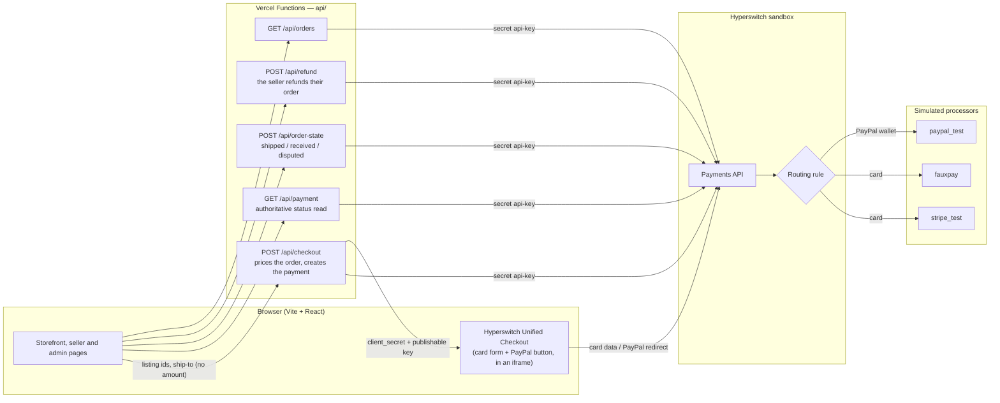
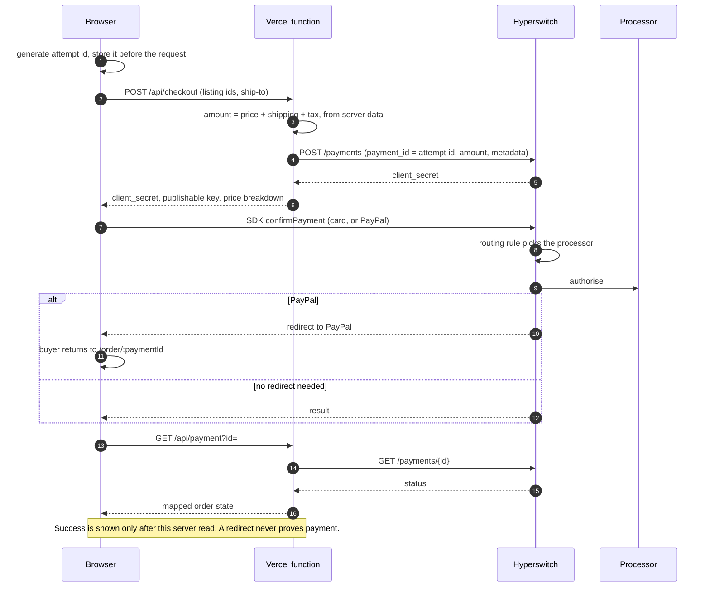
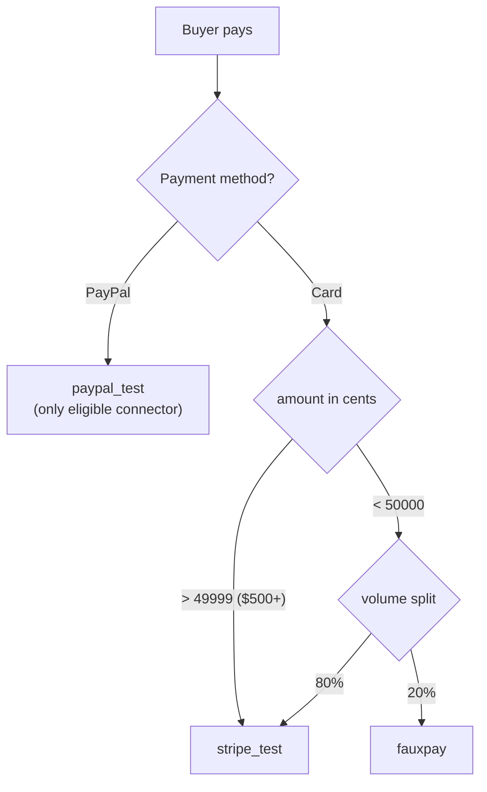
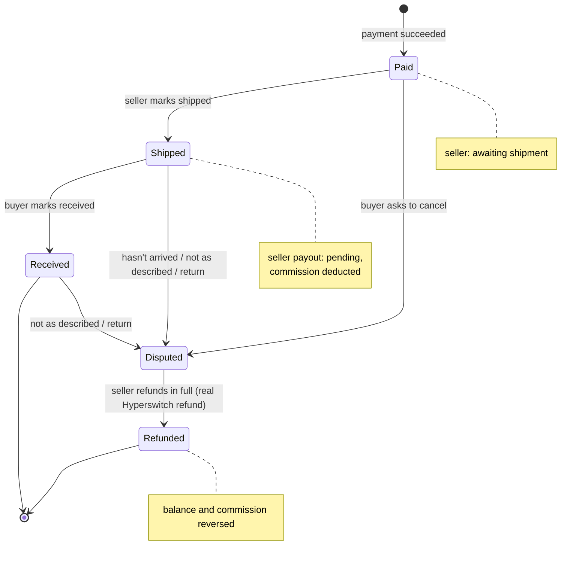

# Slabbed — a collectibles marketplace on Hyperswitch

A peer-to-peer marketplace for US coins and trading cards that takes a buyer
from browsing to a **real, completed payment in the Hyperswitch sandbox**, and
then on through shipping, disputes and refunds.

> **Status:** payment path and marketplace screens built; sandbox configured
> and verified on 2026-09-16. **Proven in a real browser against the live
> sandbox:** Playwright tests covered card payment, hard decline, PayPal,
> ship → receive, dispute → full refund, the ambiguous "don't pay again" state,
> and the reviewer security checks. The e2e suite hasn't been re-run since the
> latest checkout and account changes, and `account.spec` and
> `multi-seller.spec` still assert older copy ("Visa ending in 4242"); the
> server-side sandbox suite (22 tests) passes.
> [PLAN.md](PLAN.md) holds the full reasoning, and this file is the summary.
> Everything under "Not built" is written up with an approach instead.
>
> **Live demo:** <https://juspay-prototype.vercel.app> (deployed from `main`
> on Vercel, running against the Hyperswitch sandbox).

---

## The marketplace

Individuals list, individuals buy, buy-it-now only. Any account can be buyer
and seller, which is how collectors behave. Prices run from a $20 raw card to a
$6,000 graded coin in the same catalogue, and that spread shapes most of the
payment decisions below.

```
Buyer ──pays──> Slabbed ──holds──> (seller ships directly) ──releases──> Seller
                   │                                                       │
                   ├── commission ──> Slabbed          payout ────────────┘
                   └── sales tax ───> State            to PayPal / bank
```

## What payments have to get right here

1. **We hold a stranger's money until another stranger ships.** Capture
   timing, refunds and release are one question about who carries risk in
   that gap.
2. **The payment method decides who carries the risk.** PayPal's buyer
   protection covers "not authentic" and "misrepresented condition", but its
   *seller* protection excludes not-as-described, and as merchant of record the
   dispute names us. Cards follow network rules we can predict.
3. **Retry safety beats conversion.** Retrying an ambiguous payment can charge
   one collector twice for another collector's coin. A double charge between
   two individuals can't be fixed by apologising.
4. **More than one provider is structural.** Buyers expect cards and PayPal;
   sellers want payouts to a bank or PayPal; high-value buyers will want
   financing. No single provider does all of it, which is why we use an
   orchestrator.

---

## Architecture

No database and no custom backend server. The browser talks to a handful of
Vercel functions, and those are the only code holding the secret key.
Hyperswitch is the record of truth for payments, and even fulfilment state
(shipped, received, disputed) lives in the payment's own metadata.



**Security boundaries**
- The secret key (`JUSPAY_API_TEST_KEY`) is read only inside `api/` and never
  has a `VITE_` prefix, since Vite would inline it into the bundle.
- **The server sets the amount** from its own catalogue. The checkout request
  type has no `amount` field at all. One demo simplification: a listing a
  collector creates in the browser (`usr_…`) isn't in the server catalogue, so
  its price comes from the client.
- Card numbers only ever enter Hyperswitch's iframe, so they stay out of our
  code and our PCI scope.

---

## A payment, end to end



**Idempotency.** Hyperswitch has no idempotency header on `POST /payments`,
so the browser's attempt id doubles as the `payment_id`. A duplicate submit,
refresh or second tab re-sends the same id. Hyperswitch rejects it with
`HE_01`, and the server reads the existing payment instead of creating a
second one: it resumes it if it's still unattempted and the amount matches,
and otherwise sends the buyer to the order page.

**Every Hyperswitch status is mapped**, all 17 of them, not only the four in
the quickstart. `requires_customer_action` and `processing` are their own
states, never failures. The order page polls the server for about 30 seconds
while a payment is in flight or its status is unrecognised (`unknown`), then
shows "Don't pay again yet" and a **Check again** button that only re-reads.

---

## Payment methods and routing

**The buyer chooses a payment method. Hyperswitch chooses the processor.** The
buyer only ever sees "Card" or "PayPal", and processors stay out of sight.

| Buyer chooses | Goes to | Why, for this marketplace |
| --- | --- | --- |
| **PayPal** | `paypal_test` | The buyer's choice, not a routing decision: it's the only connector with the PayPal wallet. Offered at every price, because collectors come from eBay and expect it |
| **Card, $500 or more** | `stripe_test` | The primary processor, every time. With retries refused there is no second attempt, so high-value slabs aren't used for experiments |
| **Card, under $500** | 80% `stripe_test` / 20% `fauxpay` | A challenger processor trialled against the incumbent, on orders where a failure costs a $40 sale rather than a one-of-one coin |
| No rule matches | `stripe_test` → `fauxpay` → `paypal_test` | Default fallback. `paypal_test` is last so a card payment never shows up as "PayPal" |



**Why split small card payments at all.** A marketplace adds a second
processor for lower fees, negotiating leverage and outage cover, but it can't
judge one without sending it real traffic. The approval rate on *our* buyers
is the number that matters. The split gathers that data, and it's the first
step towards Auth Rate Based routing, which needs about 25 finished payments
per processor before it can score anything. Our prices decide where to run
the trial: most orders are small and most money sits in the few large ones,
so orders under $500 produce data quickly at little risk. We chose 80/20 over
50/50 because the point is to measure a challenger against the incumbent,
starting small.

**This is routing before an attempt, not retrying after one.** Auto Retries
was on by default (max 3). We switched it off, because re-sending a timed-out
$6,000 payment to a second processor can charge the buyer twice. Hyperswitch
reconciles the two attempts afterwards but can't un-charge the card.

**Verified against the live sandbox (2026-09-16):**

| Test | Result |
| --- | --- |
| $900 card, $500.00 card | `stripe_test` |
| 20 × $40 card | 12 `stripe_test`, 8 `fauxpay` |
| PayPal at $40 and at $900 | `paypal_test`, `requires_customer_action` with a redirect |
| `is_auto_retries_enabled` | `false` |

**What the sandbox can't show.** The processors are simulated and approve and
decline identically, so the build shows the routing *mechanism* but not one
processor genuinely out-approving another. Decline messages come from a
simulator, not a card issuer.

---

## Order and money lifecycle

Money moves when someone acts, not on a timer, so every transition is
something a reviewer can click.



The buyer is charged **item + shipping + sales tax** (a flat 8% on items). The
seller is credited **item + shipping − commission** (5% of items) once they
ship. The buyer never sees the commission and the seller never sees the tax.
No payout is actually sent (the sandbox has no payout rail), so shipped money
shows as **Payout pending**.

### A multi-seller cart: one payment, one order per seller

A buyer who checks out items from two sellers pays **once**, and gets **two
orders**, one per seller. That's the eBay and Etsy model, and the alternatives
both break something collectors care about:

| Option | What goes wrong |
| --- | --- |
| One payment per seller | Two charges on the statement, two PayPal redirects, and a cart that can end half paid: seller A charged, seller B declined |
| One order for the whole cart | Sellers ship on different days. One seller's refund request would hold, or refund, the other seller's sale |
| **One payment, one order per seller** (built) | The buyer pays once; each seller's order ships, pays out and refunds on its own |

**How it maps onto Hyperswitch.** There's no order table, so the split lives
on the payment:

- The payment's metadata lists `sellers`, and every per-seller value is a flat
  key prefixed with the seller id: `sel_bluesheet.itemsCents`,
  `sel_bluesheet.fulfilment`, `sel_bluesheet.shippedAt`. Flat, because
  Hyperswitch merges metadata shallowly.
- An order's id is `<paymentId>.<sellerId>`. Order pages, the seller's list
  and every action address that, never the bare payment.
- **Tax is rounded per seller**, so the payment total is exactly the sum of its
  orders, and refunding one order returns exactly what it added. Rounding once
  on the cart would leave a cent that belongs to nobody.
- **A refund is a partial refund of the shared payment**, for that one order's
  total, and only the order's seller can issue it. Its `refund_id` is derived
  from the payment, the seller and an attempt counter, so a double click can't
  refund twice, and two sellers refunding the same payment can never exceed
  what was charged.

**What this costs.** The shared payment is one unit to the card network: a
chargeback, or a payment that fails after the fact, names every order in it,
and working out which seller it belongs to is our job (not built; it needs
webhooks). Real payouts need a marketplace product that sends each seller
their own share after shipping; see *Seller payouts* below.

### When something goes wrong: problems, returns and questions

The buyer's order page has one **Have a problem?** menu per seller order. It
lists every option every time, and greys out the ones that can't apply yet
with the reason, so a buyer never wonders whether an option exists:

| Option | Open when | Asks for a refund |
| --- | --- | --- |
| Cancel and refund | Not shipped yet | Yes |
| It hasn't arrived | Shipped, not marked received | Yes |
| Not as described | Shipped or received, **even if ineligible for return** | Yes |
| Return it | Shipped or received, and the seller accepts returns | Yes |
| Ask the seller | Always | **No**: the order doesn't move |

Why it's shaped this way for collectibles:

- **Not every problem is a refund.** A buyer whose coin hasn't shipped after
  two days usually wants an answer, not their money back. "Ask the seller"
  records a question without holding the seller's payout.
- **Returns are the seller's call, per listing.** A raw coin "sold as found"
  from an estate lot and a graded slab with a cert number are different
  risks, so each listing says *Returns accepted* or *Ineligible for return*,
  on the listing page, in checkout and on the order.
- **"Not as described" can't be switched off.** That's the US buyer-protection
  norm (eBay's guarantee, PayPal's cover, card chargeback rights), and a
  marketplace that let sellers opt out would be taking the dispute anyway.
- **Eligibility is fixed at purchase.** It's written onto each seller's order
  in the payment metadata when the payment is created, so a seller changing
  their policy later doesn't change an order already paid for. A refund covers
  a seller's whole order, so one ineligible item makes that order ineligible.
- **The server enforces the same rules as the menu** (`issueBlock` in
  `src/shared/orderState.ts`, used by both), so a request crafted outside the
  page can't return an ineligible item or cancel a shipped one.

Every refund-type problem ends the same way: the seller sees what was asked
and refunds that order in full through Hyperswitch. What this doesn't do yet
is under *Not built*.

---

## Decisions

| Decision | Why |
| --- | --- |
| **Unified Checkout SDK** | Card data never touches our code, and payment methods are a dashboard setting. Affirm was removed without a code change, and PayPal needed only a return URL passed to the SDK, which is the practical argument for an orchestrator |
| **Simulated processors, not real Stripe** | Real Stripe needs a support ticket for raw card data access, with unknown lead time. The simulators cover everything the core flow needs: distinct hard declines, a PayPal redirect, and three connectors to route between |
| **Capture immediately; the hold is a ledger, not an authorisation** | Card authorisations expire in about 7 days, and an individual seller ships when they reach the post office. The reversal tool is a refund, not a void |
| **Seller pays the commission, at release** | Nothing is added to a buyer's total after they've decided on a $1,800 item. A sale refunded before release never pays a fee |
| **Never auto-retry an ambiguous payment** | "Check again", not "Pay again". A double charge is worse than a lost sale |
| **One payment for a multi-seller cart, split per seller on our side** | Collectors buy from several sellers at once and expect to pay once, as on eBay and Etsy. One payment can't end half paid. Each seller's share ships, pays out and refunds on its own, so one seller's dispute never refunds another's sale |
| **No database; Hyperswitch is the read model** | No reconciliation story to explain. The limit: metadata isn't filterable in the v1 API, so order lists page through the last 90 days of payments (at most 2,000) and filter in memory. Measured: 1.3–2.0 s warm, 4.6–6.5 s on a cold first call. A KV index of order ids is the upgrade |
| **Checkout opens over the page, not as a page** | The buyer keeps the listing or cart in view while giving an address and paying. It's addressed by `?checkout` on the current URL, so sign-in can send the buyer back into it. It's a fixed layer rather than a native `<dialog>`, because the Hyperswitch SDK appends its own full-screen frames to the page and the dialog's top layer would cover them. It can't be closed while a payment is starting or confirming. Shipping and billing (default "same as shipping") are both stored on the Hyperswitch payment; editing them before paying updates the same unconfirmed payment (`POST /payments/{id}`), so the attempt id and amount stay the same and nothing is charged twice. Pay stays disabled until the SDK reports the form complete (a saved card needs its CVC). The account page saves a shipping and a billing address, and checkout pre-fills them and remembers what the buyer used; they're stored in the browser, like the rest of the mock profile |
| **Returns per listing; "not as described" always open** | See *When something goes wrong*. Collectibles mix as-found raw items with certified slabs, so one blanket return policy would be wrong for one of them |
| **Show credit or debit on saved cards and receipts** | Read from Hyperswitch (`payment_method_type`, falling back to the card's `card_type`). A buyer's dispute rights and timelines differ between the two, and on a four-figure coin that's worth knowing before choosing which card to pay with |
| **3DS out of scope for this build** | The dashboard default is untouched, but no challenge flow is built or tested. We're US-only, so it isn't a mandate. It would buy liability shift on stolen-card chargebacks, which matters on a $6,000 coin. It does nothing for "not as described" disputes, and we don't pretend it does |

### Hyperswitch features, and what we did with each

| Feature | Verdict |
| --- | --- |
| Unified Checkout, Payments, Refunds (one seller's order in full), Metadata update | **Built on** |
| Rule-based routing (amount + volume split) | **Configured**, verified |
| PayPal wallet | **Configured**, plus a return URL passed to the SDK |
| 3DS | **Out of scope**: dashboard default untouched, no challenge flow built or tested |
| Auto Retries / Smart Retries | **Turned off**, for the double-charge reason above |
| Auth Rate Based and elimination routing | **Deferred**: needs payment history and real processors |
| Least Cost (US debit) routing | **Deferred**: sandbox supports it through Adyen only |
| Webhooks | **Deferred**: nothing durable to write to and no stable URL, and every flow we build has the buyer present |
| Saved payment methods | **Built on**: a $0 setup payment through the SDK saves a card to the Hyperswitch customer; the account lists and removes cards, and sets the default with `POST /customers/{id}/payment_methods/{pm}/default`, which the SDK then pre-selects at checkout. Re-setting the current default returns `400 IR_16`, treated as success. Card data never reaches us |
| Extended authorisation, overcapture, network tokenisation | **Off**: we capture straight away at a fixed amount |
| Surcharge | **Refused**: banned on debit, restricted in several states, and we earn through commission |

---

## Not built, with the approach

- **Affirm (pay later).** It fits the top of this market: a collector who
  wants a $6,000 slab now and pays over months. Affirm pays us up front and
  takes the credit risk, so our hold doesn't change. It's deferred because it
  adds a second redirect method with its own pending and declined-application
  states. *Approach:* enable Pay Later → Affirm on a connector (the sandbox's
  `stripe_test` already offers it), show it only above about $500, and confirm
  on the server exactly as for PayPal.
- **ACH bank debit.** It costs about $5 against about $174 in card fees on a
  $6,000 slab, but a consumer can return a debit as unauthorised for 60 days.
  *Approach:* only for buyers with a completed purchase, payout held until the
  debit clears, and the payment shown as `processing` meanwhile. Needs real
  Stripe.
- **Limiting PayPal where it hurts us.** Gold coins aren't covered by PayPal's
  buyer protection but can still be charged back to us. *Approach:* the server
  passes `allowed_payment_method_types` when it creates the payment (verified
  in the sandbox), so gold coins or large orders show cards only.
- **Real Stripe and real PayPal** behind the same routing rule. This changes
  dashboard configuration only, not code.
- **Auth Rate Based routing,** once about 25 real payments per processor
  exist. It's the next step after the 80/20 trial.
- **Apple and Google Pay.** They add speed, not protection, and Apple Pay
  needs a stable verified domain, which preview deployments don't have.
- **Seller payouts.** Stripe Connect separate charges and transfers: one
  charge for the cart, then one transfer per seller order, called when that
  seller ships. Hyperswitch's split payments only support direct/destination
  charges, which pay the seller too early and can't wait for each seller's
  shipment. Until then the seller page shows shipped money as *Payout pending*.
- **3DS challenges, refunding part of one seller's order, soft declines on demand, and an
  abandoned PayPal payment** (the message exists; the flow isn't tested).
- **The return leg of a return.** A return request today is a refund request
  with a reason; nothing tracks the item going back, so a seller can refund
  before it arrives, or not at all. *Approach:* two more fulfilment states,
  `returning` (buyer adds tracking) and `returned` (seller confirms), with the
  refund offered only after `returned`, plus a **return window** (14 or 30
  days from received, the US norm) checked by the same `issueBlock` rule.
- **Refund requests vs bank disputes.** An in-app "not as described" is a
  request to the seller; the buyer can still dispute with their bank, and we
  don't read Hyperswitch's disputes. *Approach:* dispute webhooks, matched to
  the seller order by payment and amount, freeze that seller's payout and
  close any open in-app request so the buyer isn't refunded twice.
- **Two-way questions and notifications.** "Ask the seller" is one question,
  one way: the seller can read it but not reply, and a second question
  replaces the first. Nobody is emailed about a question, a refund request or
  a shipment. *Approach:* a message thread per seller order in a small store,
  plus email on each order action.
- **Webhooks, concurrency (two buyers racing for one item), carrier-confirmed
  release, authenticity checks, seller KYC, saved bank accounts, and saving
  PayPal** (`paypal_test` doesn't store a PayPal account, so the account page's
  linked PayPal is for show; PayPal still signs in through Hyperswitch at
  checkout).

**Known gaps in what is built**
- `update_metadata` returns a connector error (`IR_20`, seen on both
  `paypal_test` and `stripe_test`) even though the write lands, so every write
  is read back before the UI reports success.
- Order lists take 4.6–6.5 s on a cold first call (see the read-model decision
  above).
- A chargeback on a multi-seller payment isn't attributed to a seller: there are
  no webhooks to receive it, and nothing splits it across the orders.

---

## Running it

Requires Node 20.19+ (Vite 8's minimum) and a Hyperswitch sandbox account with
the setup below.

```bash
npm install
cp .env.example .env   # secret key, publishable key, merchant id
npm run dev            # Vite serves the front end and api/ functions together
```

| Command | What it does |
| --- | --- |
| `npm run dev` | App and API functions locally (Vite middleware runs `api/`) |
| `npm run build` | Typecheck and production build |
| `npm run test:unit` | 39 money, cart, attempt-id and state-mapping tests. No keys needed |
| `npm run test:sandbox` | 21 tests that call the `api/` handlers against the live sandbox. Needs `.env`; skipped without the key. Creates real payments tagged `test` |
| `npm run e2e` | 11 Playwright tests in a real browser against the real sandbox. Needs `.env` and `npx playwright install chromium`; starts its own dev server on port 5190 |
| `npm run lint` / `npm run format` | oxlint / Prettier |

### Sandbox setup

1. **Connectors:** `stripe_test`, `fauxpay` and `paypal_test`, all with credit
   and debit cards. Enable Wallet → PayPal on `paypal_test` only.
2. **Default fallback order:** `stripe_test`, `fauxpay`, `paypal_test`.
3. **Workflow → Routing → Rule Based**, then activate it:
   - card AND amount < `50000` → volume split 80 `stripe_test` / 20 `fauxpay`
   - card AND amount > `49999` → priority `stripe_test`
   - Amounts are **cents**. There's no "greater than or equal", hence `49999`.
4. **Payment settings:** Auto Retries **off**, then save.

### Test cards

Any future expiry, any CVC. These cards behave the same on `stripe_test` and
`fauxpay`, so routing doesn't change the result.

| Case | Card | Buyer sees |
| --- | --- | --- |
| Success | `4242 4242 4242 4242` | Paid |
| Declined | `4000 0000 0000 0002` | "Your bank declined this payment." |
| Lost / stolen | `4000 0000 0000 9987` / `…9979` | "Your bank declined this card." |
| PayPal | PayPal button | Redirect to simulated PayPal, then back |

A soft decline (`4000 0000 0000 9995`) can't be shown on demand: it succeeds on
`stripe_test` and only fails on `fauxpay`, which routing reaches at random.

## Stack

Vite · React 19 · TypeScript · Tailwind CSS v4 · Vercel Functions (standard
`Request`/`Response`) · `@juspay-tech/react-hyper-js` · Vitest · Playwright.
`vercel.json` sends every path except `/api/*` to the SPA. Set the same `.env`
keys in Vercel's project settings to deploy.
